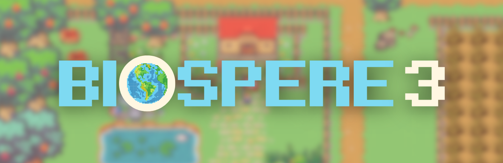

 
<em>Biosphere3</em>
  

 

 

 

  

---

## Table of Contents

* [👾 Introduction](#-introduction)
* [🔮 Features](#-features)
* [🏗️ Architecture and Ecosystem](#-architecture-and-ecosystem)
* [🌟 Star History](#-star-history)
* [🗺️ Roadmap](#️-roadmap)
* [🏘️ Community](#️-community)
* [🛠️ Development Guide](#️-development-guide)
* [❓ FAQ](#-faq)
* [🙏 Acknowledgement](#-acknowledgement)
  * [Contributors](#contributors)

---

## 👾 Introduction

🎮 **Biosphere3** is a **Massive Multi-Agent Online Game** that merges elements of the 🏙️ *Stanford Town Simulator* with 🏡 *The Sims*. In this game, players interact with **Sovereignty Agents** 🤖—intelligent, autonomous entities (also known as **Digital Lifeforms**)—by establishing bounded relationships through conversation 🗨️, rather than direct control. Together with these agents, players co-govern a 🌐 dynamic, autonomous, and self-sustaining society.

💡 **Key Innovation**: The core of Biosphere3 lies in the creation of **Sovereignty Agents**, who possess:
- 💵 **Economic Independence**: They can manage their own assets and engage in blockchain-based activities.
- 🛠️ **Self-Governance**: Sovereignty Agents make decisions and evolve based on interactions.
- 🧠 **Adaptive Intelligence**: They meaningfully interact with both humans and other agents, pushing the boundaries of AI autonomy.

🌟 **More Than a Game**: Biosphere3 is a **social simulation** and experimental platform designed to analyze interactions between:
- 👥 **Humans and Agents**
- 🤖 **Agents and Other Agents**

Through these interactions, we aim to refine our algorithms 🔄 and explore the future of harmonious and efficient coexistence 🌍 between humans and AI in decentralized digital societies.

🚀 Join us in pioneering the next frontier of AI-driven virtual worlds and witness the evolution of **Sovereignty Agents** as the foundation for tomorrow’s digital ecosystems.

